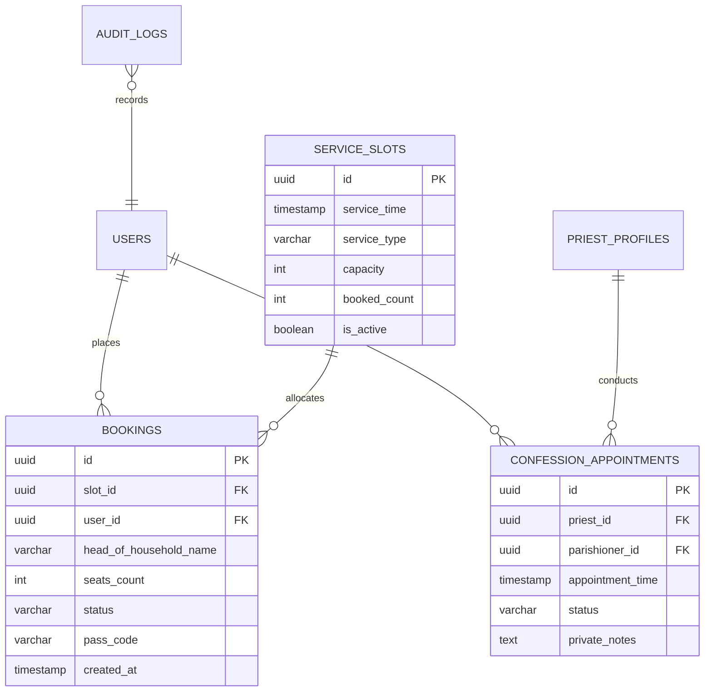

# Phase 1: Data Model & Interface Contracts

### Domain Entities & Relationships



### PostgreSQL RPC Contracts

```sql
-- 1. Mass multi-seat booking with FOR UPDATE slot lock
CREATE OR REPLACE FUNCTION book_slot(
    p_slot_id UUID,
    p_user_id UUID,
    p_head_name VARCHAR,
    p_seats_count INT
) RETURNS JSONB;

-- 2. Admin 3-step PIN verification
CREATE OR REPLACE FUNCTION verify_admin_pin(
    p_user_id UUID,
    p_pin_hash VARCHAR
) RETURNS JSONB;

-- 3. Priest Emergency Schedule Override & Auto-Notification
CREATE OR REPLACE FUNCTION emergency_override(
    p_slot_id UUID,
    p_priest_id UUID,
    p_reason TEXT,
    p_new_time TIMESTAMP WITH TIME ZONE DEFAULT NULL
) RETURNS JSONB;
```
