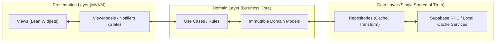
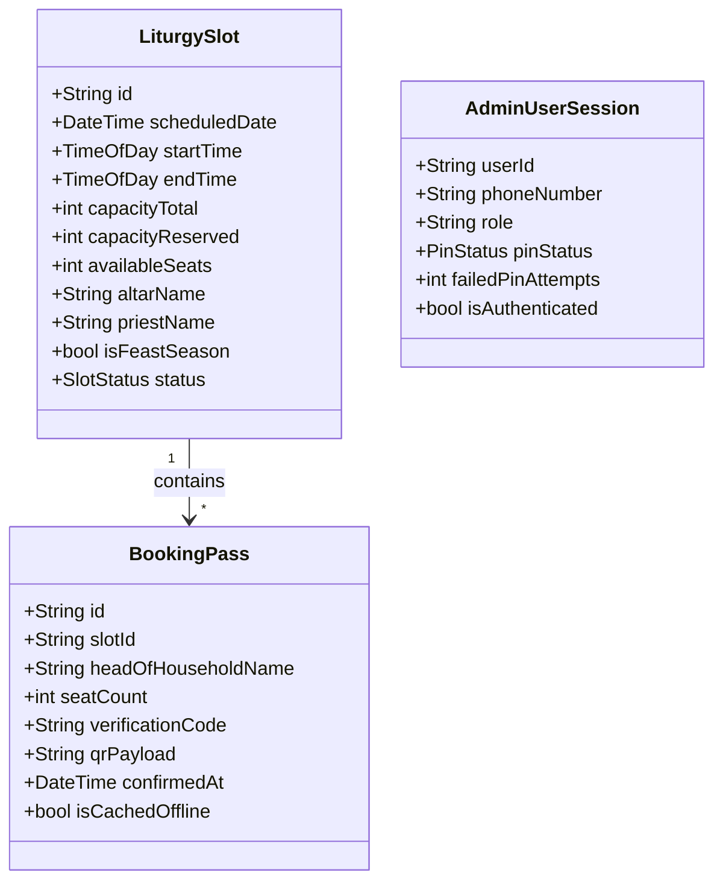

# Implementation Plan: Egyptian Coptic Orthodox Church Digital Platform UI & Architecture

**Branch**: `001-church-platform-ui` | **Spec**: [specs/001-church-platform-ui/spec.md](file:///c:/church/specs/001-church-platform-ui/spec.md)  
**Architecture Guidelines**: [Flutter Layered Architecture & Best Practices](file:///c:/church/.agents/skills/flutter-apply-architecture-best-practices/SKILL.md) & [Coptic Heritage Digital Design System](file:///c:/church/docs/design/DESIGN.md)

---

## 1. Summary

This implementation plan establishes the architectural blueprint for the Egyptian Coptic Orthodox Church Digital Platform. It executes the frontend presentation and domain layers across two client applications:
1. **Parishioner Mobile App (`apps/mobile/`)**: Holy Mass multi-seat reservation (max 4 seats), Confession scheduling with Father of Confession, offline pass caching (QR + 4-char entry code), and 100% 5-state UI coverage.
2. **Clergy & Admin Web Portal (`apps/admin/`)**: 3-Step Multi-Factor Authentication (Phone $\to$ WhatsApp OTP $\to$ Memorized 4–6 digit PIN), first-run PIN setup, self-service OTP recovery, real-time parish operations KPI dashboard, and Priest Emergency Overrides.

Both applications adopt a strict **Layered MVVM + Repository Pattern** powered by `flutter_riverpod` (v3.4.2), `go_router` (v17.4.0), and `supabase_flutter` (v2.17.1), enforcing complete separation of concerns, zero layout shifts (shimmer skeletons), and robust offline resilience.

---

## 2. Technical Context

| Attribute | Specification Details |
| :--- | :--- |
| **Language & SDK** | Dart 3.12+ / Flutter 3.x (Null Safety, Pattern Matching, Record Types) |
| **State Management** | `flutter_riverpod: ^3.4.2` (`NotifierProvider`, `AsyncNotifierProvider`) |
| **Routing** | `go_router: ^17.4.0` (Declarative, Auth Guarded, Deep-link capable) |
| **Backend & Auth** | `supabase_flutter: ^2.17.1` (Postgres 16, RLS boundary, Security Definer RPCs, Vault PIN verification) |
| **Localization & Font** | `flutter_localizations` (RTL Arabic-first), `Cairo` font family (Weights 400, 600, 700) |
| **Chart & Analytics** | `fl_chart: ^0.70.0` (Admin Portal KPI visualizations) |
| **Local Offline Cache** | `shared_preferences` / Hive secure local storage for offline entry passes |
| **Testing** | `flutter_test` (Unit, Provider, MockClient integration, Widget tests with Arabic text verification) |
| **Performance Target** | 60/120 FPS rendering, zero Content Layout Shift ($\text{CLS} \le 0.05$), $\text{Time-to-Interactive} < 1.2\text{s}$ |

---

## 3. Constitution & Architecture Quality Gates



### Architecture Guardrails:
1. **Zero UI Business Logic**: Views contain zero SQL, HTTP, or data mutation logic. Views only consume immutable states from Riverpod `NotifierProvider`s and emit intent events.
2. **RPC-Only State Mutations**: The client never executes direct table `UPDATE`/`INSERT` queries for reservations. All state transitions flow through transactional PostgreSQL RPCs (`book_slot`, `verify_admin_pin`, `set_admin_pin`, `emergency_override`).
3. **Structured 5-State UI Engineering**: Every screen implements Ideal, Empty, Loading Skeleton (no centered spinners), Error (with inline retry), and Partial/Lockout states.
4. **Deterministic Mockability**: Repositories accept injected service interfaces; all widget and provider tests utilize deterministic `MockClient` fixtures.

---

## 4. Project Structure

```text
apps/
├── mobile/
│   └── lib/
│       ├── core/
│       │   ├── router/          # AppRouter with GoRouter & auth redirects
│       │   ├── theme/           # Coptic Heritage theme (Colors, Cairo Typography, Glassmorphism)
│       │   └── widgets/         # ShimmerSkeleton, AppButton, AppCard, ErrorRetryView
│       ├── data/
│       │   ├── models/          # Raw API DTOs (SlotDto, BookingDto, PriestDto)
│       │   ├── repositories/    # LiturgyRepository, ConfessionRepository, PassCacheRepository
│       │   └── services/        # SupabaseRpcService, LocalPassStorageService
│       ├── domain/
│       │   ├── models/          # Immutable Models (LiturgySlot, BookingPass, PriestProfile)
│       │   └── use_cases/       # ValidateSeatAllocationUseCase, CheckSeasonalLimitUseCase
│       └── features/
│           ├── liturgy/         # LiturgyBookingScreen, LiturgyViewModel, SeatStepperWidget
│           ├── confession/      # ConfessionBookingScreen, ConfessionViewModel, PriestCardWidget
│           └── passes/          # BookingPassesScreen, OfflinePassView, QrCodeWidget
│
└── admin/
    └── lib/
        ├── core/
        │   ├── auth/            # AdminAuthNotifier, AdminAuthStatus enum, AdminSession
        │   ├── router/          # AdminRouter with 3-Step PIN guard
        │   └── theme/           # Desktop Web Theme (RTL Sidebar, Navy Palette, Gold Accents)
        ├── data/
        │   ├── models/          # AdminSlotDto, KpiMetricsDto, RefundRequestDto
        │   ├── repositories/    # AdminAuthRepository, AdminLiturgyRepository, KpiRepository
        │   └── services/        # AdminSupabaseService
        ├── domain/
        │   ├── models/          # AdminUser, DashboardMetrics, SlotScheduleItem
        │   └── use_cases/       # VerifyAdminPinUseCase, TriggerEmergencyOverrideUseCase
        └── features/
            ├── auth/            # AdminLoginScreen (Phone -> OTP -> PIN -> Setup -> Reset)
            ├── dashboard/       # DashboardScreen, KpiSummaryCards, AttendanceChart
            ├── slots/           # SlotManagementScreen, SlotScheduleTable, EmergencyDialog
            └── refunds/         # RefundQueueScreen, RefundAuditTable
```

---

## 5. Phase 0: Technical Research & Architecture Decisions (`research.md`)

```markdown
# Technical Research & Architectural Decisions

### 1. State Management: Riverpod Notifier vs. Bloc
- **Decision**: Adopt Riverpod 3.x with code-agnostic `NotifierProvider` and `AsyncNotifierProvider`.
- **Rationale**: Riverpod offers compile-safe dependency injection, effortless auto-dispose for ephemeral screen state, clean test override semantics without mocking `BuildContext`, and seamless integration with `GoRouter` refresh listeners.
- **Alternatives Rejected**: 
  - `Bloc/Cubit`: Too much boilerplate for simple form inputs and step navigation.
  - `setState/InheritedWidget`: Prone to widget rebuild cascades and difficult to test headlessly.

### 2. Offline Pass Caching Strategy for Low-Connectivity Sanctuaries
- **Decision**: Store confirmed booking passes locally as JSON payloads containing a cryptographically signed HMAC token and 4-character alphanumeric code.
- **Rationale**: Sanctuaries and church basements often suffer complete cellular blackout. A locally cached pass with scannable QR ensures zero door congestion.
- **Data Persistence**: `shared_preferences` with encrypted string serialization.

### 3. Admin Multi-Factor 3-Step Authentication State Machine
- **Decision**: Model `AdminAuthStatus` as a 6-state finite state machine:
  `initial` $\to$ `loading` $\to$ `otpSent` $\to$ `pinRequired` / `pinSetupRequired` $\to$ `authenticated` / `accessDenied` / `lockedOut`.
- **Rationale**: Clean state segregation prevents race conditions between WhatsApp OTP delivery and backend PIN verification.
```

---

## 6. Phase 1: Domain Models & Interface Contracts (`data-model.md` & `contracts/`)

### Domain Entity Models



### Supabase PostgreSQL RPC Interface Contracts

```sql
-- 1. Liturgy Multi-Seat Reservation
FUNCTION book_slot(
    p_slot_id UUID,
    p_head_of_household_name TEXT,
    p_seat_count INT
) RETURNS JSONB;
-- Returns: { "success": true, "booking_id": "...", "entry_code": "A8F2", "qr_token": "..." }

-- 2. Admin PIN Status Check
FUNCTION admin_pin_status() 
RETURNS TEXT; 
-- Returns: 'SET' | 'UNSET' | 'LOCKED'

-- 3. Verify Admin Memorized PIN
FUNCTION verify_admin_pin(p_pin TEXT) 
RETURNS BOOLEAN;

-- 4. Set Initial Admin PIN (First Run / OTP Reset)
FUNCTION set_admin_pin(p_pin TEXT) 
RETURNS BOOLEAN;

-- 5. Priest Emergency Override
FUNCTION emergency_override(
    p_slot_id UUID,
    p_reason TEXT,
    p_reschedule_date TIMESTAMP WITH TIME ZONE DEFAULT NULL
) RETURNS JSONB;
```

---

## 7. Phase 1: Quickstart & End-to-End Validation Guide (`quickstart.md`)

```markdown
# Validation & Quickstart Test Scenarios

### Scenario 1: Parishioner Multi-Seat Booking (P1)
1. Run: `flutter test test/features/liturgy/liturgy_booking_test.dart`
2. Validate:
   - Initial load renders `LiturgySkeletonView` (CLS = 0).
   - Available seats display "متبقي ١٢ مقعد".
   - Seat stepper clamps between 1 and 4 seats.
   - Submitting reservation with 3 seats invokes `book_slot` RPC with correct JSON payload.
   - Successful confirmation displays `BookingPassCard` and writes pass to local offline cache.

### Scenario 2: Admin 3-Step Authentication Flow (P1)
1. Run: `flutter test test/features/auth/admin_auth_test.dart` (from `apps/admin/`)
2. Validate:
   - Step 1: Submitting phone "+201000000001" transitions status to `otpSent`.
   - Step 2: Entering valid OTP "123456" invokes `admin_pin_status()` RPC $\to$ transitions to `pinRequired`.
   - Step 3: Entering correct 6-digit PIN invokes `verify_admin_pin` RPC $\to$ navigates to `DashboardScreen`.
   - Setup Flow: When `admin_pin_status()` returns `UNSET`, UI renders PIN Setup + Confirm fields $\to$ invokes `set_admin_pin`.
   - Reset Flow: Clicking "Forgot PIN" triggers OTP challenge and allows establishing a new PIN.

### Scenario 3: Static Analysis & Code Quality
1. Run: `flutter analyze lib test` in `apps/mobile/` (0 warnings, 0 errors).
2. Run: `flutter analyze lib test` in `apps/admin/` (0 warnings, 0 errors).
```

---

## 8. Completion & Next Steps

The implementation plan is complete and fully reconciled with:
- The [Feature Specification](file:///c:/church/specs/001-church-platform-ui/spec.md)
- All 5 clarification decisions (4-seat cap, self-service OTP PIN reset, 2-hour confession cutoff, offline pass caching, dynamic seasonal caps)
- The [Flutter Layered Architecture Best Practices](file:///c:/church/.agents/skills/flutter-apply-architecture-best-practices/SKILL.md)

👉 **Next Step**: Run **`/speckit-tasks`** to generate the phased, prioritized engineering task breakdown and TDD implementation plan.