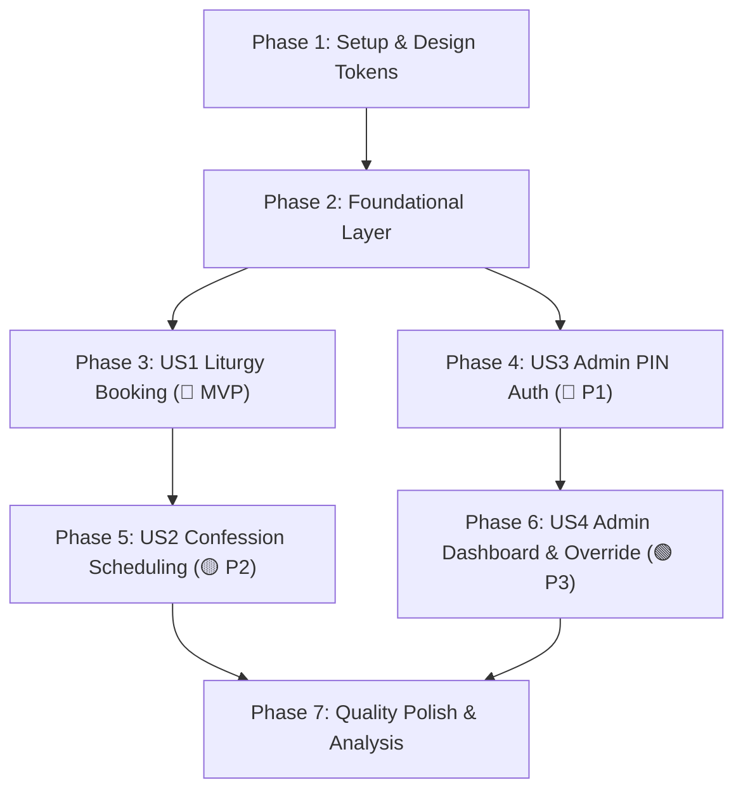

# Tasks: Egyptian Coptic Orthodox Church Digital Platform UI & Architecture

**Input**: Design documents from `specs/001-church-platform-ui/`  
**Prerequisites**: [`plan.md`](file:///c:/church/specs/001-church-platform-ui/plan.md), [`spec.md`](file:///c:/church/specs/001-church-platform-ui/spec.md), [`data-model.md`](file:///c:/church/specs/001-church-platform-ui/data-model.md), [`quickstart.md`](file:///c:/church/specs/001-church-platform-ui/quickstart.md)  
**Architecture Guidelines**: [Flutter Layered Architecture](file:///c:/church/.agents/skills/flutter-apply-architecture-best-practices/SKILL.md) & [5-State UI Engineering](file:///c:/church/.agents/skills/continuous-discovery-ux/SKILL.md)

---

## Task Execution Summary

| Phase | Story / Focus | Priority | Tasks | Parallel Tasks |
| :--- | :--- | :---: | :---: | :---: |
| **Phase 1** | Setup & Design System Tokens | — | T001–T004 | 3 |
| **Phase 2** | Foundational Infrastructure | — | T005–T009 | 3 |
| **Phase 3** | US1: Liturgy Multi-Seat Booking & Offline Pass | 🎯 **P1 (MVP)** | T010–T018 | 5 |
| **Phase 4** | US3: Admin 3-Step PIN Auth & OTP Reset | 🔴 **P1** | T019–T027 | 4 |
| **Phase 5** | US2: Confession Appointment Scheduling | 🟡 **P2** | T028–T034 | 4 |
| **Phase 6** | US4: Admin Dashboard & Emergency Overrides | 🟢 **P3** | T035–T041 | 3 |
| **Phase 7** | Polish, Benchmarks & Validation | — | T042–T046 | 3 |
| **Total** | **Full Ecosystem Implementation** | | **46 Tasks** | **25 Parallel** |

---

## Phase 1: Setup (Shared Infrastructure & Theming)

**Purpose**: Establish Coptic Heritage theme tokens, Cairo Arabic typography, and reusable 5-state UI primitives.

- [ ] T001 Configure Coptic Heritage color tokens and glassmorphism themes in `apps/mobile/lib/core/theme/coptic_theme.dart`
- [ ] T002 [P] Configure Cairo font typography hierarchy and RTL layout helpers in `apps/mobile/lib/core/theme/typography.dart`
- [ ] T003 [P] Implement layout-mirroring Shimmer Skeleton widget (zero CLS) in `apps/mobile/lib/core/widgets/shimmer_skeleton.dart`
- [ ] T004 [P] Implement reusable Arabic Error and Inline Retry widget in `apps/mobile/lib/core/widgets/error_retry_view.dart`

---

## Phase 2: Foundational (Blocking Prerequisites)

**Purpose**: Core data layer abstractions, Supabase MockClient test harness, and local pass cache infrastructure.

**⚠️ CRITICAL**: Must be completed before user story implementation begins.

- [ ] T005 Setup shared Supabase RPC execution wrapper and error mapping in `apps/mobile/lib/data/services/supabase_rpc_service.dart`
- [ ] T006 [P] Implement local offline pass storage service using shared preferences in `apps/mobile/lib/data/services/local_pass_storage_service.dart`
- [ ] T007 [P] Create mock Supabase test client builder with RPC interceptors in `apps/mobile/test/helpers/mock_supabase_client.dart`
- [ ] T008 [P] Create mock Supabase test client builder for admin RPCs in `apps/admin/test/helpers/mock_admin_supabase_client.dart`
- [ ] T009 Implement base declarative GoRouter configuration with Arabic locale in `apps/mobile/lib/core/router/app_router.dart`

**Checkpoint**: Foundational layer complete. User stories can now be implemented in priority order.

---

## Phase 3: User Story 1 - Holy Mass Multi-Seat Reservation & Offline Pass (Priority: P1) 🎯 MVP

**Goal**: Enable parishioners to view Mass schedules, reserve up to 4 seats with head-of-household name, enforce seasonal caps, and view cached digital entry passes with offline QR codes.

**Independent Test**: Run `flutter test test/features/liturgy/liturgy_booking_test.dart`. Selecting 3 seats for Sunday Mass successfully invokes `book_slot` RPC, deducts remaining capacity, and caches the entry pass with QR code locally.

### Tests for User Story 1
- [ ] T010 [P] [US1] Unit test for `ValidateSeatAllocationUseCase` (1–4 seat bounds, seasonal caps) in `apps/mobile/test/domain/use_cases/validate_seat_allocation_test.dart`
- [ ] T011 [P] [US1] Integration test for Liturgy Booking and Offline Pass Caching in `apps/mobile/test/features/liturgy/liturgy_booking_test.dart`

### Implementation for User Story 1
- [ ] T012 [P] [US1] Create immutable `LiturgySlot` and `BookingPass` domain models in `apps/mobile/lib/domain/models/liturgy_slot.dart`
- [ ] T013 [P] [US1] Implement `LiturgyRepository` consuming Supabase RPC and local cache in `apps/mobile/lib/data/repositories/liturgy_repository.dart`
- [ ] T014 [US1] Implement `ValidateSeatAllocationUseCase` and `CheckSeasonalLimitUseCase` in `apps/mobile/lib/domain/use_cases/validate_seat_allocation_use_case.dart`
- [ ] T015 [US1] Implement `LiturgyBookingNotifier` (Riverpod) with 5-state handling in `apps/mobile/lib/features/liturgy/liturgy_booking_notifier.dart`
- [ ] T016 [P] [US1] Build family seat counter stepper widget (1–4 seats) in `apps/mobile/lib/features/liturgy/widgets/seat_stepper_widget.dart`
- [ ] T017 [US1] Build `LiturgyBookingScreen` matching Coptic Heritage UI design in `apps/mobile/lib/features/liturgy/liturgy_booking_screen.dart`
- [ ] T018 [US1] Build `OfflineBookingPassScreen` with scannable QR and 4-character entry code in `apps/mobile/lib/features/passes/offline_booking_pass_screen.dart`

**Checkpoint**: User Story 1 (MVP) is fully functional and independently testable offline.

---

## Phase 4: User Story 3 - Admin 3-Step PIN Auth & OTP Reset (Priority: P1)

**Goal**: Implement the 3-step security verification (Phone $\to$ WhatsApp OTP $\to$ Memorized 4–6 digit PIN), first-run PIN setup, and self-service OTP reset flow for admin web users.

**Independent Test**: Run `flutter test test/features/auth/admin_auth_test.dart` in `apps/admin/`. Verify phone + OTP verification, PIN status check (`SET`/`UNSET`/`LOCKED`), numeric PIN pad entry, and self-service OTP reset.

### Tests for User Story 3
- [ ] T019 [P] [US3] Unit tests for `AdminAuthNotifier` state machine (all 6 statuses) in `apps/admin/test/core/auth/admin_auth_notifier_test.dart`
- [ ] T020 [P] [US3] Widget test for 3-step login card and numeric keypad in `apps/admin/test/features/auth/admin_login_screen_test.dart`

### Implementation for User Story 3
- [ ] T021 [P] [US3] Update `AdminAuthStatus` enum with `pinRequired`, `pinSetupRequired`, and `lockedOut` in `apps/admin/lib/core/auth/admin_auth_status.dart`
- [ ] T022 [US3] Implement `AdminAuthRepository` handling `admin_pin_status`, `verify_admin_pin`, and `set_admin_pin` in `apps/admin/lib/data/repositories/admin_auth_repository.dart`
- [ ] T023 [US3] Implement `AdminAuthNotifier` with 5-attempt lockout and OTP reset in `apps/admin/lib/core/auth/admin_auth_notifier.dart`
- [ ] T024 [P] [US3] Build obscured PIN dot indicator widget with gold glow in `apps/admin/lib/features/auth/widgets/pin_indicator_widget.dart`
- [ ] T025 [P] [US3] Build accessible Arabic numeric keypad grid in `apps/admin/lib/features/auth/widgets/numeric_keypad_widget.dart`
- [ ] T026 [US3] Build `AdminLoginScreen` with 3-step progress bar and PIN setup view in `apps/admin/lib/features/auth/admin_login_screen.dart`
- [ ] T027 [US3] Configure GoRouter redirect guards checking PIN authentication state in `apps/admin/lib/core/router/admin_router.dart`

**Checkpoint**: User Stories 1 and 3 are complete and secure.

---

## Phase 5: User Story 2 - Confession Appointment Private Scheduling (Priority: P2)

**Goal**: Allow parishioners to browse clergy, select a Father of Confession, reserve 15-minute counseling slots with private notes, and cancel $\ge 2$ hours prior.

**Independent Test**: Run `flutter test test/features/confession/confession_booking_test.dart`. Reserving a 15-min slot with private note locks the slot; cancelling $\ge 2$ hours before re-opens it.

### Tests for User Story 2
- [ ] T028 [P] [US2] Unit tests for confession 2-hour cancellation rule in `apps/mobile/test/domain/use_cases/confession_cancellation_test.dart`
- [ ] T029 [P] [US2] Widget test for priest profile card and slot selector in `apps/mobile/test/features/confession/confession_booking_screen_test.dart`

### Implementation for User Story 2
- [ ] T030 [P] [US2] Create `PriestProfile` and `ConfessionAppointment` models in `apps/mobile/lib/domain/models/confession_appointment.dart`
- [ ] T031 [US2] Implement `ConfessionRepository` with slot status transitions in `apps/mobile/lib/data/repositories/confession_repository.dart`
- [ ] T032 [US2] Implement `ConfessionBookingNotifier` in `apps/mobile/lib/features/confession/confession_booking_notifier.dart`
- [ ] T033 [P] [US2] Build `PriestProfileCard` and 15-minute slot chips widget in `apps/mobile/lib/features/confession/widgets/slot_chips_widget.dart`
- [ ] T034 [US2] Build `ConfessionBookingScreen` with encrypted private notes textarea in `apps/mobile/lib/features/confession/confession_booking_screen.dart`

**Checkpoint**: User Stories 1, 2, and 3 functional.

---

## Phase 6: User Story 4 - Admin Dashboard & Emergency Overrides (Priority: P3)

**Goal**: Provide clergy and administrators with real-time KPI metrics, liturgy schedule tables, 1-click Emergency Overrides, and refund queue auditing.

**Independent Test**: Run `flutter test test/features/dashboard/dashboard_screen_test.dart` in `apps/admin/`. Triggering an emergency override transitions slot status to Cancelled and enqueues refund records.

### Tests for User Story 4
- [ ] T035 [P] [US4] Unit test for `TriggerEmergencyOverrideUseCase` in `apps/admin/test/domain/use_cases/emergency_override_test.dart`
- [ ] T036 [P] [US4] Widget test for KPI cards and slot schedule table in `apps/admin/test/features/dashboard/dashboard_screen_test.dart`

### Implementation for User Story 4
- [ ] T037 [P] [US4] Create `DashboardKpiMetrics` and `SlotScheduleItem` domain models in `apps/admin/lib/domain/models/dashboard_models.dart`
- [ ] T038 [US4] Implement `AdminLiturgyRepository` handling `emergency_override` RPC in `apps/admin/lib/data/repositories/admin_liturgy_repository.dart`
- [ ] T039 [P] [US4] Build real-time KPI summary metric cards widget in `apps/admin/lib/features/dashboard/widgets/kpi_summary_cards.dart`
- [ ] T040 [US4] Build Liturgy schedule data table with capacity progress bars in `apps/admin/lib/features/slots/widgets/slot_schedule_table.dart`
- [ ] T041 [US4] Build `PriestEmergencyOverrideDialog` and connect to `DashboardScreen` in `apps/admin/lib/features/dashboard/dashboard_screen.dart`

**Checkpoint**: All user stories (P1, P2, P3) complete.

---

## Phase 7: Polish, Quality Benchmarking & Cross-Cutting Concerns

**Purpose**: Verify zero-layout shift, static analysis compliance, RTL text rendering, and end-to-end validation.

- [ ] T042 [P] Verify zero Content Layout Shift ($\text{CLS} \le 0.05$) across all screens using shimmer skeletons
- [ ] T043 [P] Audit all Arabic strings for RTL alignment, Cairo typography scaling, and zero text overflow
- [ ] T044 Run `flutter analyze lib test` across `apps/mobile/` (ensure 0 issues)
- [ ] T045 Run `flutter analyze lib test` across `apps/admin/` (ensure 0 issues)
- [ ] T046 Execute full validation test suite per `specs/001-church-platform-ui/quickstart.md`

---

## Implementation Strategy & MVP Delivery

1. **MVP Milestone (User Story 1)**: Complete Phases 1, 2, and 3 $\to$ Parishioners can immediately book Liturgy seats and access offline passes.
2. **Security Milestone (User Story 3)**: Complete Phase 4 $\to$ Admin portal is hardened with 3-Step Phone + OTP + PIN authentication.
3. **Full Pastoral Release (User Stories 2 & 4)**: Complete Phases 5 and 6 $\to$ Confessions, dashboard analytics, and emergency overrides active.