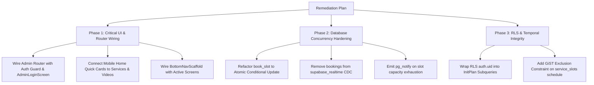

# Church Digital Platform — Comprehensive Engineering & Architectural Review

---

## 1. Executive Summary & Readiness Verdict

The **Church Digital Platform** project ([`CONTEXT.md`](file:///c:/church/CONTEXT.md)) is architecturally structured around a PostgreSQL/Supabase backend, a Flutter Mobile app (parishioner-facing), and a Flutter Web app (admin dashboard). 

| Component | Status | Spec Accuracy | High-Concurrency Qualification | Production Readiness |
| :--- | :---: | :---: | :---: | :---: |
| **Backend & Database** | 🟡 Partial / Solid Core | **85%** | **65%** (Pessimistic locks & CDC bottlenecks need refactoring) | Needs Concurrency Hardening |
| **Edge Functions (Deno)** | 🟢 High | **92%** | **90%** (Idempotent outbox, token handling solid) | Ready with minor config checks |
| **Admin Web App** | 🟡 Partial | **80%** | N/A (Admin session scale) | Route wiring & login guard disconnected |
| **Parishioner Mobile App** | 🔴 Incomplete Wiring | **60%** | N/A (Client-side) | Core screens built but disconnected from Router/Home |

> [!IMPORTANT]
> **Overall Qualification Verdict**: **Not yet ready for live high-concurrency production drops**, but the foundation is well-organized. The core domain logic, security definer transition engine, and Deno edge workers are implemented, but **routing disconnects in both frontends** and **database concurrency bottlenecks (Pillar 2 & 3 violations)** must be addressed before opening to thousands of concurrent parishioners.

---

## 2. Product Accuracy & Feature-by-Feature Review (Spec Axis)

### 2.1 Authentication & Phone-First WhatsApp OTP
* **Authoritative Spec**: [`docs/superpowers/plans/2026-08-12-auth-rework-phone-first.md`](file:///c:/church/docs/superpowers/plans/2026-08-12-auth-rework-phone-first.md)

| Sub-feature | Implementation Source | Status | Finding / Accuracy Assessment |
| :--- | :--- | :---: | :--- |
| **WhatsApp OTP Hook** | [`supabase/functions/otp-sms/index.ts`](file:///c:/church/supabase/functions/otp-sms/index.ts#L10-L100) | 🟢 Qualified | Validates standard webhooks signature (`whsec_`), dispatches Meta Graph API `otp_auth` template in Arabic (`ar`). |
| **Admin Memorized PIN** | [`supabase/migrations/0034_admin_pins.sql`](file:///c:/church/supabase/migrations/0034_admin_pins.sql#L16-L134) | 🟢 Qualified | `set_admin_pin`, `verify_admin_pin`, and `admin_pin_status` with `pgcrypto` Blowfish hashing, 5-attempt rate-limiting, and 15-minute lockouts. |
| **Admin 3-Step Login UI** | [`apps/admin/lib/features/auth/admin_login_screen.dart`](file:///c:/church/apps/admin/lib/features/auth/admin_login_screen.dart#L127-L235) | 🟡 Disconnected | Implements Phone → WhatsApp OTP → Memorized PIN (or first-run PIN setup). **However, it is NOT wired into [`app_router.dart`](file:///c:/church/apps/admin/lib/app_router.dart)**. |
| **Mobile Phone-First Gate** | [`apps/mobile/lib/core/auth/phone_verify_gate.dart`](file:///c:/church/apps/mobile/lib/core/auth/phone_verify_gate.dart#L47-L84) | 🟢 Qualified | Reusable inline bottom sheet & gate allowing public browsing without forced login until booking/checkout action. |

---

### 2.2 Booking & Reservation Engine
* **Authoritative Spec**: [`docs/superpowers/plans/2026-08-10-church-digital-platform-master-plan.md`](file:///c:/church/docs/superpowers/plans/2026-08-10-church-digital-platform-master-plan.md) & [`docs/adr/0001-v1-domain-model-refinements.md`](file:///c:/church/docs/adr/0001-v1-domain-model-refinements.md)

| Sub-feature | Implementation Source | Status | Finding / Accuracy Assessment |
| :--- | :--- | :---: | :--- |
| **Atomic Slot Booking** | [`supabase/migrations/0008_booking_state_machine.sql`](file:///c:/church/supabase/migrations/0008_booking_state_machine.sql#L40-L79) | 🟡 Functional / High Lock Contention | Correctly checks maximum 3 active bookings, slot status, and duplicate bookings. Sets 20-minute `locked_until`. But uses pessimistic row locks (`FOR UPDATE`) instead of atomic conditional updates. |
| **Single-Writer Transition Engine** | [`supabase/migrations/0024_transition_engine.sql`](file:///c:/church/supabase/migrations/0024_transition_engine.sql#L15-L54) | 🟢 Qualified | Centralized `transition_booking_status` enforcing state machine invariants and audit trail creation. |
| **Paymob Checkout & Webhook** | [`supabase/functions/paymob-checkout/index.ts`](file:///c:/church/supabase/functions/paymob-checkout/index.ts#L13-L84) & [`supabase/functions/paymob-webhook/index.ts`](file:///c:/church/supabase/functions/paymob-webhook/index.ts#L44-L82) | 🟢 Qualified | Full HMAC-SHA-512 authentication, safe string equality check, and late webhook auto-refund trigger if lock expired. |
| **Lock Expiry Cron** | [`supabase/migrations/0010_lock_expiry_cron.sql`](file:///c:/church/supabase/migrations/0010_lock_expiry_cron.sql) | 🟢 Qualified | Automatically releases `PENDING_PAYMENT` bookings after timeout and triggers waiting list promotions. |

---

### 2.3 Specialized Church Services
* **Authoritative Spec**: [`CONTEXT.md`](file:///c:/church/CONTEXT.md#L7-L17) (Liturgies/Masses, Weddings, Baptisms, Funerals/Condolences, Trips/Vacations)

| Sub-feature | Implementation Source | Status | Finding / Accuracy Assessment |
| :--- | :--- | :---: | :--- |
| **Services Catalog & Slot Grid** | [`apps/mobile/lib/features/booking/services_list_screen.dart`](file:///c:/church/apps/mobile/lib/features/booking/services_list_screen.dart) & [`apps/mobile/lib/features/booking/slot_grid_screen.dart`](file:///c:/church/apps/mobile/lib/features/booking/slot_grid_screen.dart#L147-L300) | 🟢 Qualified | Displays Arabic service types, real-time availability chips (`AVAILABLE`, `BOOKED`, `CLOSED`), location, and pricing. |
| **Manual Booking (Cash/In-Person)** | [`supabase/migrations/0015_manual_book.sql`](file:///c:/church/supabase/migrations/0015_manual_book.sql#L2-L37) & [`apps/admin/lib/features/bookings/manual_book_screen.dart`](file:///c:/church/apps/admin/lib/features/bookings/manual_book_screen.dart#L58-L82) | 🟢 Qualified | Admin/Priest creates cash booking immediately in `CONFIRMED` state with WhatsApp opt-in capture. |
| **Emergency Override (Reschedule/Refund)** | [`supabase/migrations/0017_emergency_override.sql`](file:///c:/church/supabase/migrations/0017_emergency_override.sql#L3-L54) & [`apps/admin/lib/features/bookings/emergency_override_screen.dart`](file:///c:/church/apps/admin/lib/features/bookings/emergency_override_screen.dart) | 🟢 Qualified | Atomic transition to `RESCHEDULED`, books new slot, dispatches WhatsApp apology & reschedule notices, and enqueues refund. |

---

### 2.4 Parishioner Mobile Shell & Screen Navigation
* **Authoritative Spec**: [`docs/design/DESIGN.md`](file:///c:/church/docs/design/DESIGN.md) & [`specs/001-church-platform-ui/spec.md`](file:///c:/church/specs/001-church-platform-ui/spec.md)

| Sub-feature | Implementation Source | Status | Finding / Accuracy Assessment |
| :--- | :--- | :---: | :--- |
| **Home Hub Screen** | [`apps/mobile/lib/screens/home_hub_screen.dart`](file:///c:/church/apps/mobile/lib/screens/home_hub_screen.dart#L167-L191) | 🔴 Incomplete Wiring | Quick action cards (`QuickMass`, `QuickConfession`, `QuickBooking`, `QuickVideos`, `QuickComplaints`) are **static containers with no `onTap` navigation handlers**. |
| **Bottom Navigation Scaffold** | [`apps/mobile/lib/widgets/bottom_nav_scaffold.dart`](file:///c:/church/apps/mobile/lib/widgets/bottom_nav_scaffold.dart#L33-L41) | 🔴 Incomplete Wiring | Tabs 2, 3, 4 are hardcoded to `ComingSoonTab()`, and [`app_router.dart`](file:///c:/church/apps/mobile/lib/app_router.dart#L54-L70) routes directly to `HomeHubScreen` instead of `BottomNavScaffold`. |
| **My Bookings & Digital Ticket** | [`apps/mobile/lib/features/booking/my_bookings_screen.dart`](file:///c:/church/apps/mobile/lib/features/booking/my_bookings_screen.dart) & [`apps/mobile/lib/features/booking/booking_ticket_screen.dart`](file:///c:/church/apps/mobile/lib/features/booking/booking_ticket_screen.dart) | 🟡 Isolated | Fully built and tested in unit tests, but not linked from the main bottom navigation bar or drawer. |

---

### 2.5 Admin Web Dashboard & Security Operations
* **Authoritative Spec**: [`HANDOFF.md`](file:///c:/church/HANDOFF.md#L30-L43) & [`apps/admin/README.md`](file:///c:/church/apps/admin/README.md)

| Sub-feature | Implementation Source | Status | Finding / Accuracy Assessment |
| :--- | :--- | :---: | :--- |
| **Admin Shell Navigation** | [`apps/admin/lib/app_router.dart`](file:///c:/church/apps/admin/lib/app_router.dart#L12-L129) | 🟡 Missing Auth Guard | ShellRoute provides side navigation for Bookings, Manual Book, Emergency, Complaints, Analytics, and Videos, but default route opens `/bookings` directly without redirecting unauthenticated users to `/login`. |
| **Encrypted Complaints Inbox** | [`apps/admin/lib/features/complaints/complaints_admin_screen.dart`](file:///c:/church/apps/admin/lib/features/complaints/complaints_admin_screen.dart#L51-L80) & [`supabase/migrations/0026_complaints_pgcrypto.sql`](file:///c:/church/supabase/migrations/0026_complaints_pgcrypto.sql) | 🟢 Qualified | Decrypts PGP-encrypted parishioner complaints via `decrypt_complaint` RPC restricted to `is_admin()`. |
| **Analytics & Reporting** | [`apps/admin/lib/features/analytics/analytics_admin_screen.dart`](file:///c:/church/apps/admin/lib/features/analytics/analytics_admin_screen.dart) & [`supabase/functions/analytics-export/index.ts`](file:///c:/church/supabase/functions/analytics-export/index.ts) | 🟢 Qualified | Attendance charts, utilization percentages, CSV export sanitization with formula injection protection (`=`, `+`, `-`, `@`). |

---

## 3. High-Concurrency Backend Architecture Review (`supabase-high-concurrency-backend`)

Evaluating the database schema, RPCs, and queuing against the **5 Core Architectural Pillars**:

### Pillar 1: Dual-Frontend Connection Segregation
* **Requirement**: Client App on Port `6543` (Transaction Mode, 70% pool budget, prepared statements OFF); Admin App on Port `5432` (Session Mode, 20% pool budget); Workers on direct connections (10%).
* **Current State**: Supabase client initialization in [`apps/mobile/lib/main.dart`](file:///c:/church/apps/mobile/lib/main.dart) and [`apps/admin/lib/main.dart`](file:///c:/church/apps/admin/lib/main.dart) relies on standard PostgREST HTTPS endpoints.
* **Finding**: While PostgREST handles HTTP concurrency at the API gateway layer, edge functions and direct pool connections in configuration files lack explicit connection budget partitioning.

### Pillar 2: Atomic Concurrency Control & Inventory Integrity
* **Requirement**: Reject `SELECT FOR UPDATE` and dynamic `COUNT(*)` under flash sale contention. Enforce **Atomic Conditional Updates** (`UPDATE ... WHERE remaining >= qty`) paired with a schema `CHECK` constraint.
* **Current State in Code**:
  In [`supabase/migrations/0008_booking_state_machine.sql:L53-L64`](file:///c:/church/supabase/migrations/0008_booking_state_machine.sql#L53-L64):
  ```sql
  select * into v_slot from public.service_slots where id = p_slot_id for update;
  ...
  select public.active_booking_count(p_slot_id) into v_active;
  if v_active >= v_slot.capacity then raise exception 'SLOT_FULL' using errcode = 'P0001'; end if;
  insert into public.bookings ...
  ```
* **Critical Finding**: 
  1. This holds a pessimistic table/row lock on `service_slots` and performs an index scan aggregation `active_booking_count()` across `public.bookings` for every incoming reservation request. Under flash-sale conditions (e.g., 2,000 requests in 10 seconds for Easter liturgy), this will create connection queuing and lock manager memory pressure.
  2. The table `service_slots` does not have a `remaining_seats` column or a schema-level `CHECK` invariant `CHECK (booked_seats <= capacity)`.

### Pillar 3: Real-Time Instant Inventory Closure
* **Requirement**: Never publish high-frequency transactional write tables (`bookings`) to WAL CDC `supabase_realtime`. Use database triggers with `pg_notify` / Phoenix Broadcast for inventory closure.
* **Current State in Code**:
  In [`supabase/migrations/0031_realtime_publication.sql:L17-L28`](file:///c:/church/supabase/migrations/0031_realtime_publication.sql#L17-L28):
  ```sql
  ALTER PUBLICATION supabase_realtime ADD TABLE public.bookings;
  ALTER PUBLICATION supabase_realtime ADD TABLE public.service_slots;
  ```
* **Critical Finding**: Adding `bookings` directly to `supabase_realtime` CDC forces PostgreSQL's logical replication engine to evaluate RLS per connected subscriber row. Under high write throughput, this can saturate the database CPU.

### Pillar 4: Ultra-Performant Multi-Tenant RBAC & RLS
* **Requirement**: Scalar subquery InitPlan caching `(SELECT auth.uid())` and JWT claims extraction from `auth.jwt() -> 'app_metadata'`.
* **Current State in Code**:
  In [`supabase/migrations/0002_rls_baseline.sql:L110-L111`](file:///c:/church/supabase/migrations/0002_rls_baseline.sql#L110-L111):
  ```sql
  create policy p0_bookings_read_own on public.bookings
    for select to authenticated
    using (user_id = auth.uid()); -- Naked auth.uid()
  ```
  And in [`supabase/migrations/0002_rls_baseline.sql:L14-L24`](file:///c:/church/supabase/migrations/0002_rls_baseline.sql#L14-L24):
  ```sql
  create or replace function public.current_user_role() ...
    select coalesce((select u.role::text from public.users u where u.id = auth.uid() ...), 'anon')
  ```
* **Critical Finding**:
  1. `user_id = auth.uid()` re-evaluates the function for every scanned row. Wrapping it in `user_id = (SELECT auth.uid())` allows Postgres to cache the result as an InitPlan.
  2. `current_user_role()` queries `public.users` on disk instead of extracting custom claims from the authenticated JWT `request.jwt.claims`.

### Pillar 5: Architectural Extensibility, Temporal Integrity & Queuing
* **Requirement**: Use `TSTZRANGE` with `btree_gist` GiST exclusion constraints to prevent venue and slot scheduling collisions. Process third-party side effects asynchronously via transactional outbox.
* **Current State in Code**:
  1. **Queuing**: [`supabase/migrations/0027_event_outbox.sql`](file:///c:/church/supabase/migrations/0027_event_outbox.sql) and [`supabase/functions/event-dispatcher/index.ts`](file:///c:/church/supabase/functions/event-dispatcher/index.ts) properly decouple WhatsApp, FCM, and refund calls from the DB transactions.
  2. **Temporal Integrity**: `service_slots` uses separate `starts_at` and `ends_at` timestamps without a GiST exclusion constraint (`tstzrange(starts_at, ends_at) WITH &&, location WITH =`). Overlapping bookings for the same hall/altar are physically possible at the schema level.

---

## 4. Code Standards & Architecture Findings (Standards Axis)

Applying the Fowler Code Smells and Deep-Module architecture standards:

1. **Dead Seam / Disconnected Flow (Admin Router)**:
   - File: [`apps/admin/lib/app_router.dart:L86-L129`](file:///c:/church/apps/admin/lib/app_router.dart#L86-L129)
   - Issue: `AdminLoginScreen` exists with full 3-step PIN verification and tests, but the router starts at `/bookings` without a `/login` route or auth redirect guard.

2. **Divergent UI State / Dead Clicks (Mobile Home Hub)**:
   - File: [`apps/mobile/lib/screens/home_hub_screen.dart:L251-L297`](file:///c:/church/apps/mobile/lib/screens/home_hub_screen.dart#L251-L297)
   - Issue: The quick-action service grid displays quick cards (Mass, Confession, Booking, Videos, Complaints) but renders them as unclickable containers without navigation callbacks.

3. **Hardcoded Stubs in Shell Navigation (Mobile Navigation)**:
   - File: [`apps/mobile/lib/widgets/bottom_nav_scaffold.dart:L38-L40`](file:///c:/church/apps/mobile/lib/widgets/bottom_nav_scaffold.dart#L38-L40)
   - Issue: `BottomNavScaffold` contains 3 `ComingSoonTab()` instances even though `VideoPurchaseScreen`, `ComplaintsScreen`, and `MyBookingsScreen` have been implemented.

---

## 5. Prioritized Remediation Roadmap



### Action Items:

1. **Wire Admin Web Routing**:
   - In [`apps/admin/lib/app_router.dart`](file:///c:/church/apps/admin/lib/app_router.dart), add a `/login` route rendering [`AdminLoginScreen`](file:///c:/church/apps/admin/lib/features/auth/admin_login_screen.dart) and attach a GoRouter `redirect` callback checking `adminAuthProvider.status == AdminAuthStatus.authenticated`.

2. **Wire Mobile Shell & Quick Navigation**:
   - In [`apps/mobile/lib/app_router.dart`](file:///c:/church/apps/mobile/lib/app_router.dart), set the root builder to [`BottomNavScaffold`](file:///c:/church/apps/mobile/lib/widgets/bottom_nav_scaffold.dart).
   - In [`apps/mobile/lib/widgets/bottom_nav_scaffold.dart`](file:///c:/church/apps/mobile/lib/widgets/bottom_nav_scaffold.dart), wire `VideoPurchaseScreen` (Tab 2) and `MyBookingsScreen` (Tab 4).
   - In [`apps/mobile/lib/screens/home_hub_screen.dart`](file:///c:/church/apps/mobile/lib/screens/home_hub_screen.dart), wrap quick cards with `InkWell`/`GestureDetector` to navigate to corresponding services.

3. **Harden High-Concurrency Reservation Engine**:
   - Add `remaining_capacity INT NOT NULL` to `service_slots` with `CHECK (remaining_capacity >= 0)`.
   - Update [`book_slot`](file:///c:/church/supabase/migrations/0008_booking_state_machine.sql#L40-L79) to run an atomic decrement `UPDATE public.service_slots SET remaining_capacity = remaining_capacity - 1 WHERE id = p_slot_id AND remaining_capacity > 0`.
   - Remove `public.bookings` from `supabase_realtime` in [`0031_realtime_publication.sql`](file:///c:/church/supabase/migrations/0031_realtime_publication.sql) and trigger `pg_notify` broadcast events when `remaining_capacity = 0`.

4. **Optimize RLS Performance**:
   - Update RLS policies in [`0002_rls_baseline.sql`](file:///c:/church/supabase/migrations/0002_rls_baseline.sql) to use `(SELECT auth.uid())` InitPlan subqueries.