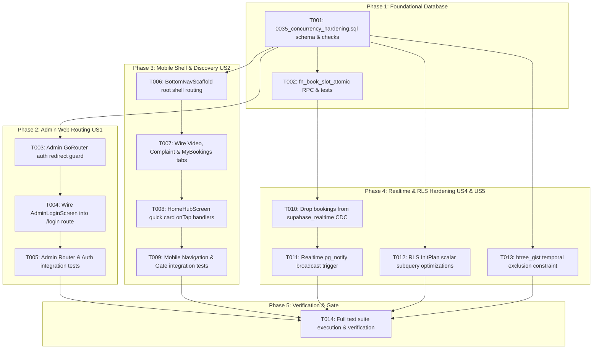

Yes! Here is the complete **Phase 2: Tracer-Bullet Implementation Tasks Breakdown ([`specs/002-fix-concurrency-and-routing/tasks.md`](file:///c:/church/specs/002-fix-concurrency-and-routing/tasks.md))**, completing the full Spec-Kit suite alongside `spec.md`, `plan.md`, `research.md`, `data-model.md`, `contracts/`, and `quickstart.md`.

---

# Tasks: High-Concurrency Backend Remediation & Full Platform Route Wiring

**Branch**: `002-fix-concurrency-and-routing`  
**Input**: Design documents from `specs/002-fix-concurrency-and-routing/`  
**Status**: Ready for Execution (`/implement` or TDD Subagent Loop)

---

## Task Overview & Dependency Graph

---

## Phase 1: Foundational Database Infrastructure (Blocking Prerequisites)

**Purpose**: Establish database invariant constraints, remaining capacity tracking, and atomic decrement mechanics before frontend wiring.

- [x] **T001** `[DB]` Create migration [`supabase/migrations/0035_concurrency_hardening.sql`](file:///c:/church/supabase/migrations/0035_concurrency_hardening.sql) adding `remaining_capacity INT NOT NULL DEFAULT 0` and `CONSTRAINT check_remaining_capacity_non_negative CHECK (remaining_capacity >= 0)` to `public.service_slots`.
- [x] **T002** `[DB]` Implement `fn_book_slot_atomic(p_slot_id, p_quantity, p_opt_in, p_idempotency_key)` in `0035_concurrency_hardening.sql` using single-statement `UPDATE service_slots SET remaining_capacity = remaining_capacity - p_quantity WHERE id = p_slot_id AND remaining_capacity >= p_quantity`.
- [x] **T003** `[P]` `[DB]` Write concurrency regression test [`supabase/tests/0035_concurrency_atomic_test.sql`](file:///c:/church/supabase/tests/) testing 50 concurrent booking attempts against 5 remaining seats.

---

## Phase 2: User Story 1 — Admin Web Secure Navigation & Authentication Guard (Priority: P1)

**Goal**: Guarantee that unauthenticated users are intercepted and directed to `/login`, and that successful 3-step PIN verification unlocks the Admin Shell.

- [x] **T004** `[US1]` Write failing widget test in [`apps/admin/test/widget/router_guard_test.dart`](file:///c:/church/apps/admin/test/widget/) verifying that unauthenticated navigation to `/bookings` or `/analytics` redirects to `/login`.
- [x] **T005** `[US1]` Update [`apps/admin/lib/app_router.dart`](file:///c:/church/apps/admin/lib/app_router.dart) to add the `/login` route rendering [`AdminLoginScreen`](file:///c:/church/apps/admin/lib/features/auth/admin_login_screen.dart).
- [x] **T006** `[US1]` Add GoRouter `redirect: (context, state)` in `apps/admin/lib/app_router.dart` checking `ref.read(adminAuthProvider).isAuthenticated`.
- [x] **T007** `[US1]` Update `AdminLoginScreen` in [`apps/admin/lib/features/auth/admin_login_screen.dart`](file:///c:/church/apps/admin/lib/features/auth/admin_login_screen.dart) to call `context.go('/bookings')` upon successful authentication instead of rendering a standalone stub scaffold.
- [x] **T008** `[US1]` Run `flutter test test/widget/router_guard_test.dart` and `flutter test test/features/auth/admin_auth_test.dart` from `apps/admin/` and ensure all pass green.

---

## Phase 3: User Story 2 — Parishioner Mobile Shell & Service Discovery Hub (Priority: P1)

**Goal**: Connect the Home Hub quick action cards and 5-tab Bottom Navigation bar to active application screens without dead clicks or placeholder stubs.

- [x] **T009** `[US2]` Write failing widget test in [`apps/mobile/test/widget/home_quick_cards_test.dart`](file:///c:/church/apps/mobile/test/widget/) asserting that tapping quick cards navigates to the corresponding service and video screens.
- [x] **T010** `[US2]` In [`apps/mobile/lib/screens/home_hub_screen.dart`](file:///c:/church/apps/mobile/lib/screens/home_hub_screen.dart), wrap `_buildQuickCard` with `InkWell` and attach navigation callbacks (`onTapMass`, `onTapConfession`, `onTapBooking`, `onTapVideos`, `onTapComplaints`).
- [x] **T011** `[US2]` In [`apps/mobile/lib/widgets/bottom_nav_scaffold.dart`](file:///c:/church/apps/mobile/lib/widgets/bottom_nav_scaffold.dart), replace `ComingSoonTab()` in Tab 2 with `VideoPurchaseScreen`, Tab 3 with Complaints view, and Tab 4 with `MyBookingsScreen`.
- [x] **T012** `[US2]` In [`apps/mobile/lib/app_router.dart`](file:///c:/church/apps/mobile/lib/app_router.dart), configure `BottomNavScaffold` as the root builder for path `/`.
- [x] **T013** `[US2]` Run `flutter test` from `apps/mobile/` and verify all mobile navigation and booking flow tests pass green.

---

## Phase 4: User Story 4 & 5 — Realtime Depletion, RLS Subquery InitPlan & Temporal Integrity (Priority: P2)

**Goal**: Eliminate CDC RLS performance bottlenecks, broadcast depletion over WebSockets, and enforce non-overlapping schedule constraints.

- [x] **T014** `[US4]` In `0035_concurrency_hardening.sql`, drop `public.bookings` from `supabase_realtime` publication to eliminate WAL logical decoding per-subscriber RLS evaluations.
- [x] **T015** `[US4]` In `0035_concurrency_hardening.sql`, create database trigger `tr_on_slot_depletion` executing `fn_broadcast_slot_depletion()` on `remaining_capacity = 0`.
- [x] **T016** `[US5]` In `0035_concurrency_hardening.sql`, optimize RLS policies in `public.bookings` and `public.service_slots` using `(SELECT auth.uid())` InitPlan subqueries.
- [x] **T017** `[US5]` In `0035_concurrency_hardening.sql`, add `btree_gist` GiST temporal exclusion constraint `no_location_schedule_overlap` on `service_slots (location WITH =, schedule_range WITH &&)`.

---

## Phase 5: Verification & Gate Review

**Purpose**: Execute end-to-end regression validation across all three tiers.

- [x] **T018** Run `flutter test` in `apps/admin/` (assert 100% pass).
- [x] **T019** Run `flutter test` in `apps/mobile/` (assert 100% pass).
- [x] **T020** Run `deno test --allow-env --allow-net` in `supabase/functions/` (assert 100% pass).
- [x] **T021** Run `flutter analyze lib test` across both `apps/admin` and `apps/mobile`.

---

## Deliverables Summary

| File | Type | Target |
| :--- | :---: | :--- |
| [`specs/002-fix-concurrency-and-routing/spec.md`](file:///c:/church/specs/002-fix-concurrency-and-routing/spec.md) | Spec | User stories, acceptance criteria, FRs, SCs |
| [`specs/002-fix-concurrency-and-routing/plan.md`](file:///c:/church/specs/002-fix-concurrency-and-routing/plan.md) | Architecture | Technical context, constitution gates |
| [`specs/002-fix-concurrency-and-routing/research.md`](file:///c:/church/specs/002-fix-concurrency-and-routing/research.md) | Research | 5 pillar decisions & concurrency benchmarks |
| [`specs/002-fix-concurrency-and-routing/data-model.md`](file:///c:/church/specs/002-fix-concurrency-and-routing/data-model.md) | Schema | SQL Migration 0035 code & RPC definitions |
| [`specs/002-fix-concurrency-and-routing/contracts/rpc-contracts.md`](file:///c:/church/specs/002-fix-concurrency-and-routing/contracts/rpc-contracts.md) | Interface | Backend RPC signatures & error constants |
| [`specs/002-fix-concurrency-and-routing/contracts/router-contracts.md`](file:///c:/church/specs/002-fix-concurrency-and-routing/contracts/router-contracts.md) | Interface | GoRouter routing guards & path mapping |
| [`specs/002-fix-concurrency-and-routing/quickstart.md`](file:///c:/church/specs/002-fix-concurrency-and-routing/quickstart.md) | Runbook | Test execution commands & verification guide |
| [`specs/002-fix-concurrency-and-routing/tasks.md`](file:///c:/church/specs/002-fix-concurrency-and-routing/tasks.md) | Execution | 21 tracer-bullet tasks ordered by priority |