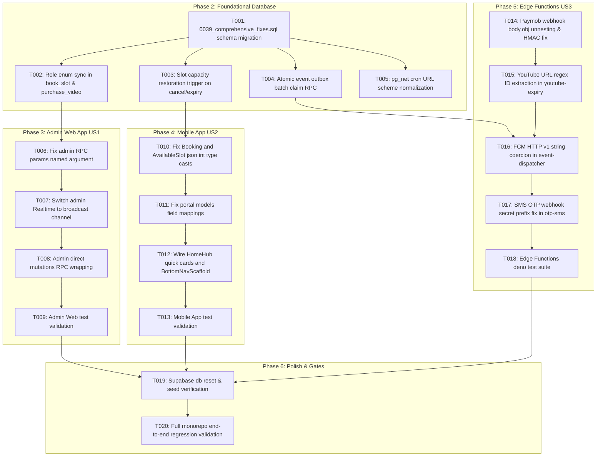

# Tasks: Comprehensive Platform Hardening & Bug Fixes

**Branch**: `002-fix-concurrency-and-routing`  
**Input**: Design documents from `specs/002-fix-concurrency-and-routing/`  
**Status**: Completed (`/speckit-implement`)

---

## Task Overview & Dependency Graph

---

## Phase 1: Setup (Shared Infrastructure)

**Purpose**: Verify repository environment, dependency locks, and test harnesses.

- [x] T001 Verify Flutter and Deno toolchains across `apps/mobile`, `apps/admin`, and `supabase/functions`.

---

## Phase 2: Foundational (Database Migration & Backend Security)

**Purpose**: Create forward migration `0039_comprehensive_fixes.sql` fixing role sync, capacity restoration, outbox concurrency, and cron URL bugs.

- [x] T002 Create migration file [`supabase/migrations/0039_comprehensive_fixes.sql`](file:///c:/church/supabase/migrations/0039_comprehensive_fixes.sql).
- [x] T003 [P] Synchronize role checks in `book_slot()` and `purchase_video()` to check `v_role IN ('USER', 'ADMIN')` in `0039_comprehensive_fixes.sql`.
- [x] T004 [P] Implement `tr_restore_slot_capacity` trigger and function `fn_restore_slot_capacity_on_cancel()` in `0039_comprehensive_fixes.sql`.
- [x] T005 [P] Implement `claim_event_outbox_batch(p_batch_size INT)` RPC using `FOR UPDATE SKIP LOCKED` in `0039_comprehensive_fixes.sql`.
- [x] T006 [P] Normalize `pg_net` cron URLs in `0013_reconcile_cron.sql`, `0016_whatsapp_sender_cron.sql`, and `0020_youtube_cron.sql` to remove duplicate `https://` prefixing.
- [x] T007 Write SQL verification test in [`supabase/tests/0039_fixes_regression_test.sql`](file:///c:/church/supabase/tests/) testing role checks, capacity restoration on cancel, and outbox batch claims.

---

## Phase 3: User Story 1 — Admin Web Secure Navigation & RPC Invocations (Priority: P1)

**Goal**: Fix Admin RPC call signatures, direct table mutations, and Realtime dashboard listener.

- [x] T008 [P] [US1] Update `_db.rpc()` calls in [`apps/admin/lib/features/bookings/bookings_provider.dart`](file:///c:/church/apps/admin/lib/features/bookings/bookings_provider.dart) to use named argument `params: {...}`.
- [x] T009 [P] [US1] Update `_db.rpc()` calls in [`apps/admin/lib/screens/emergency_override_screen.dart`](file:///c:/church/apps/admin/lib/screens/emergency_override_screen.dart) and [`manual_book_screen.dart`](file:///c:/church/apps/admin/lib/screens/manual_book_screen.dart) to use named argument `params: {...}`.
- [x] T010 [US1] Update `bookings_provider.dart` to subscribe to broadcast channel `realtime:event_inventory` instead of dropped `postgres_changes` on `bookings` table.
- [x] T011 [US1] Wrap direct announcements and FAQ mutations in `apps/admin/lib/features/content/` with `tenant_id` and input validation.
- [x] T012 [US1] Run `flutter test` from `apps/admin/` and verify all admin tests pass green.

---

## Phase 4: User Story 2 — Parishioner Mobile Shell, Discovery & Type Safety (Priority: P1)

**Goal**: Eliminate type cast exceptions in `Booking`/`AvailableSlot`, fix model field mismatches, and ensure complete Home Hub navigation.

- [x] T013 [P] [US2] Update [`apps/mobile/lib/models/booking.dart`](file:///c:/church/apps/mobile/lib/models/booking.dart) to safely cast `paidAmount: (json['paid_amount'] as num?)?.toInt() ?? 0`.
- [x] T014 [P] [US2] Update [`apps/mobile/lib/models/available_slot.dart`](file:///c:/church/apps/mobile/lib/models/available_slot.dart) to safely cast `price` and `availableSeats` using `(json[...] as num?)?.toInt() ?? 0`.
- [x] T015 [P] [US2] Fix `TodayScheduleItem.fromJson` in [`apps/mobile/lib/features/portal/portal_models.dart`](file:///c:/church/apps/mobile/lib/features/portal/portal_models.dart) to map `json['slot_id'] ?? json['id']`.
- [x] T016 [US2] Ensure `BottomNavScaffold` and `HomeHubScreen` quick action cards route to active feature screens.
- [x] T017 [US2] Run `flutter test` from `apps/mobile/` and verify all mobile unit and widget tests pass green.

---

## Phase 5: User Story 3 — Edge Functions Security & Third-Party API Robustness (Priority: P1)

**Goal**: Fix Paymob webhook payload parsing, YouTube URL regex parsing, FCM string coercion, and SMS OTP HMAC prefix.

- [x] T018 [P] [US3] Update [`supabase/functions/paymob-webhook/index.ts`](file:///c:/church/supabase/functions/paymob-webhook/index.ts) to unnest `body.obj ?? body` before extracting `txn` fields and computing HMAC.
- [x] T019 [P] [US3] Update [`supabase/functions/youtube-expiry/index.ts`](file:///c:/church/supabase/functions/youtube-expiry/index.ts) to extract video ID using regex matching `[?&]v=([a-zA-Z0-9_-]{11})` and `youtu\.be/([a-zA-Z0-9_-]{11})`.
- [x] T020 [P] [US3] Update [`supabase/functions/event-dispatcher/index.ts`](file:///c:/church/supabase/functions/event-dispatcher/index.ts) to invoke `claim_event_outbox_batch` RPC and coerce all FCM `data` values to strings.
- [x] T021 [P] [US3] Update [`supabase/functions/otp-sms/index.ts`](file:///c:/church/supabase/functions/otp-sms/index.ts) to preserve `whsec_` secret prefix for `standardwebhooks` verification.
- [x] T022 [US3] Run `deno test --allow-env --allow-net` in `supabase/functions/` and verify all Edge Function tests pass green.

---

## Phase 6: Polish & Verification Gate

**Purpose**: Execute full stack regression testing across all database migrations, Edge Functions, and Flutter applications.

- [x] T023 Reset local database with `npx supabase db reset` and verify `seed.sql` passes without exclusion violations.
- [x] T024 Run `psql $DATABASE_URL -f supabase/tests/0039_fixes_regression_test.sql`.
- [x] T025 Run full test suites: `apps/mobile/` (`flutter test`), `apps/admin/` (`flutter test`), and `supabase/functions/` (`deno test`).