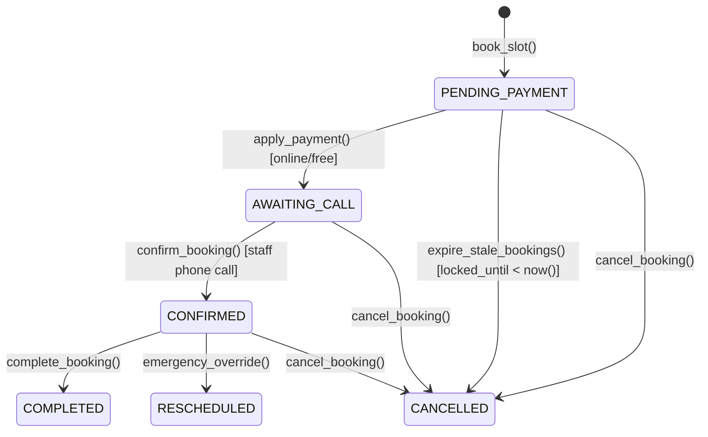
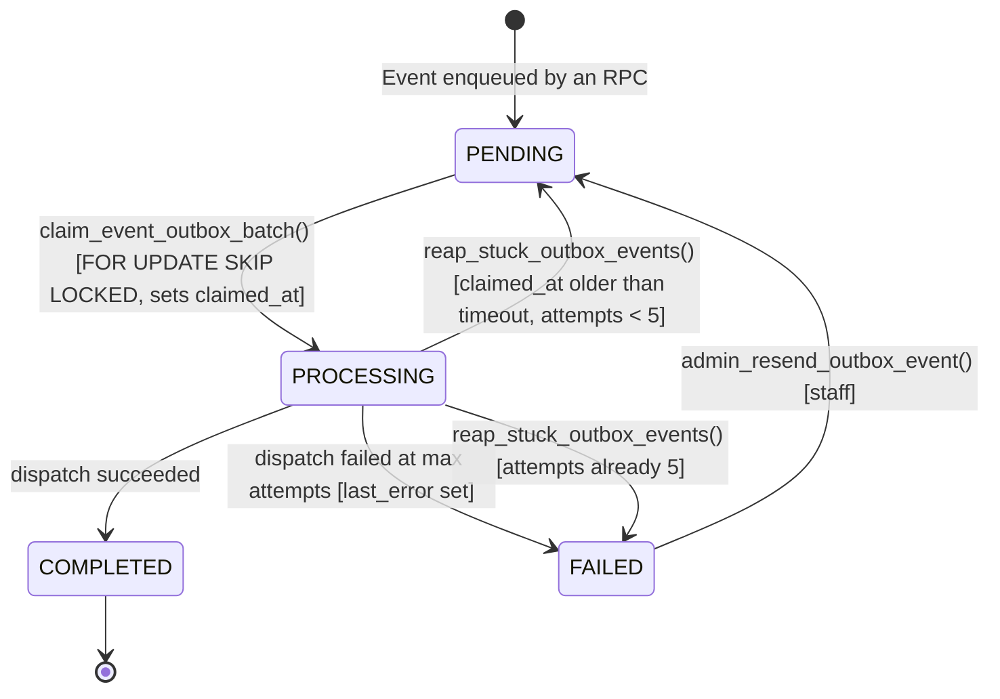

# Data Model & Schema Specification: 007-backend-security-fixes

**Feature**: Backend Security and Correctness Fixes  
**Branch**: `007-backend-security-fixes`  
**Migration Targets**: `0052_super_admin_role.sql` (enum value only) + `0053_backend_security_and_correctness_fixes.sql`

> Every column name, function signature, enum value, policy name, and grant in this document was
> verified against the live `supabase_db_church` database on 2026-08-17. Do not substitute names
> from memory or from the earlier audit prose — the audit used several column names that do not
> exist (`expires_at`, `gateway_order_id`, `raw_payload`, `start_time`, `retry_count`,
> `locked_until` on `event_outbox`).

---

## 1. Why two migrations

`ALTER TYPE ... ADD VALUE` may run inside a transaction on PostgreSQL 12+, but the newly added
label **cannot be referenced in that same transaction** (`55P04 unsafe_new_enum_value_usage`).
Supabase applies each migration file in one transaction, so `SUPER_ADMIN` must be added by a file
that does nothing else:

- **`0052_super_admin_role.sql`** — `ALTER TYPE public.app_role ADD VALUE IF NOT EXISTS 'SUPER_ADMIN';`
- **`0053_backend_security_and_correctness_fixes.sql`** — everything else, including every statement
  that references `'SUPER_ADMIN'::public.app_role`.

There is no prior `ALTER TYPE` in `supabase/migrations/`, so this hazard is untested in this repo.

---

## 2. Verified current schema (baseline)

```text
app_role                 = USER, ADMIN                       -- SUPER_ADMIN absent (added by 0052)
booking_status           = PENDING_PAYMENT, AWAITING_CALL, CONFIRMED, COMPLETED, CANCELLED, RESCHEDULED
                           -- no EXPIRED, no REFUNDED; expiry transitions to CANCELLED
outbox_status            = enum on event_outbox.status
event_handler_type       = enum on event_outbox.handler_type

users          (id, email, phone, role, tenant_id, ...)
service_slots  (id, service_id, starts_at, ends_at, capacity, price, status, location,
                tenant_id, created_at, updated_at, deleted_at, remaining_capacity, schedule_range)
bookings       (id, slot_id, user_id, status, paid_amount, payment_ref, locked_until,
                created_by, notes, tenant_id, created_at, updated_at, deleted_at, seat_count)
payments       (id, booking_id, gateway_ref, amount, status, raw_webhook, tenant_id,
                created_at, updated_at, deleted_at, merchant_order_id, video_id)
complaints     (id, ..., body_encrypted, assigned_to, tenant_id, ...)
event_outbox   (id, tenant_id, handler_type, payload, status, attempts, next_attempt_at, created_at)
audit_log      (... no tenant_id column)
roles_permissions (... no tenant_id column)
```

Bookings have **no `expires_at`** — the reservation deadline is `bookings.locked_until`, guarded by
`bookings_locked_until_check` (`locked_until IS NULL OR status = 'PENDING_PAYMENT'`).

---

## 3. Table changes

### A. `app_role` enum — migration 0052 (standalone)

```sql
ALTER TYPE public.app_role ADD VALUE IF NOT EXISTS 'SUPER_ADMIN';
```

### B. `service_slots` — remove the drifting counter

`remaining_capacity` is referenced by **three** functions, all of which must be handled before the
column is dropped. The plan previously named a non-existent `fn_decrement_slot_capacity`.

| Object | Current role | Action in 0053 |
|---|---|---|
| `fn_restore_slot_capacity_on_cancel` + trigger `tr_restore_slot_capacity` on `bookings` | increments the counter on cancel; never fires for the statuses the audit assumed | Drop trigger, then drop function |
| `fn_broadcast_slot_depletion` + trigger `tr_on_slot_depletion` on `service_slots` | `pg_notify` on `OLD.remaining_capacity > 0 AND NEW.remaining_capacity = 0` — becomes uncompilable once the column is gone | Drop trigger and function; emit the same `SLOT_EXHAUSTED` `pg_notify` payload from inside the canonical `book_slot` when the post-insert active count reaches `capacity` |
| `fn_book_slot_atomic` | helper invoked by `book_slot`; writes the counter | Fold into the canonical `book_slot` and drop |

```sql
ALTER TABLE public.service_slots DROP COLUMN remaining_capacity;
```

### C. `v_available_slots` — LEAVE AS IS

This view **already** derives availability dynamically and already carries `security_invoker=true`:

```sql
-- current definition, verified live — do not rewrite
SELECT s.id AS slot_id, s.service_id, sv.title_ar, s.starts_at, s.ends_at, s.capacity, s.price,
       s.location,
       active_booking_count(s.id) AS booked_count,
       GREATEST(s.capacity - active_booking_count(s.id), 0) AS available_seats,
       CASE WHEN s.status = 'CLOSED' THEN 'CLOSED'
            WHEN s.starts_at <= now() THEN 'CLOSED'
            WHEN active_booking_count(s.id) >= s.capacity THEN 'BOOKED'
            ELSE 'AVAILABLE' END AS slot_status
FROM service_slots s JOIN services sv ON sv.id = s.service_id
WHERE s.tenant_id = tenant_id();
```

The dynamic-capacity requirement (FR-005) is therefore **already satisfied by the view**; 007's work
is confined to deleting the redundant counter and its writers. Rewriting the view would be a
regression on three counts, so it is explicitly out of scope:

1. Renaming `available_seats` → `remaining_capacity` and `slot_status` → `status` breaks
   `apps/mobile/lib/models/available_slot.dart`, `slot_grid_screen.dart`,
   `supabase_booking_repository.dart`, `apps/admin/.../manual_book_screen.dart`,
   `emergency_override_screen.dart`, and five widget/unit tests.
2. Dropping `title_ar`/`location` breaks the slot grid and the admin manual-booking screen.
3. Recreating the view without `WITH (security_invoker = true)` and without
   `WHERE tenant_id = tenant_id()` converts it into an RLS/tenant bypass.

0053 adds a **regression test** pinning the view's column contract instead.

### D. RPC-only write boundary

```sql
REVOKE INSERT, UPDATE, DELETE ON public.payments, public.complaints,
                                 public.audit_log, public.roles_permissions
  FROM anon, authenticated;
REVOKE INSERT, UPDATE, DELETE ON public.users FROM anon, authenticated;
```

`SELECT` is retained for `authenticated` on all five tables.

**Policy replacement is mandatory, not optional.** `p0_admin_all`
(`FOR ALL TO authenticated USING (is_admin()) WITH CHECK (is_admin())`) is the **only** policy on
`payments`, `audit_log`, and `roles_permissions`. Dropping it without a replacement silently
returns zero rows to admins and breaks `apps/admin/lib/features/payments/payments_admin_screen.dart:15`.

| Table | Drop | Create in the same migration | Notes |
|---|---|---|---|
| `payments` | `p0_admin_all` | `payments_admin_select FOR SELECT TO authenticated USING (public.is_admin() AND tenant_id = public.tenant_id())` | No parishioner-facing read exists (`payments` has no `user_id`; no mobile code reads it), so admin-only SELECT is the least-privilege choice |
| `audit_log` | `p0_admin_all` | `audit_log_admin_select FOR SELECT TO authenticated USING (public.is_admin())` | **No `tenant_id` column** — do not add a tenant predicate |
| `roles_permissions` | `p0_admin_all` | `roles_permissions_admin_select FOR SELECT TO authenticated USING (public.is_admin())` | **No `tenant_id` column** |
| `complaints` | `p0_admin_all` | none needed | `complaints deny table access` (`FOR SELECT USING false`) already blocks direct reads once the permissive `p0_admin_all` stops OR-ing with it. The admin list reads `v_complaints`, which has `security_invoker=false` and therefore keeps working |

Two consequences to record rather than silently accept:

- `complaints_admin_assign` (an `UPDATE` policy) becomes unreachable once `UPDATE` is revoked. The
  admin complaints screen only *reads* `assigned_to`, so nothing breaks today; the dead policy is
  dropped for clarity, and any future assignment must go through an RPC.
- `p0_admin_all` also exists on `announcements`, `bookings`, `priests`, `service_slots`, `services`,
  `waiting_list`, `whatsapp_optins`, `videos`, `video_purchases`. Only the four sensitive tables are
  in 007 scope. `users` has **no** `p0_admin_all` (it uses granular `p0_admin_{read,insert,update,delete}_users`),
  so no drop applies there.

### E. `payments` — video decommission

```sql
ALTER TABLE public.payments DROP COLUMN IF EXISTS video_id;
```

### F. Decommissioned tables and the outbox template constraint

```sql
DROP TABLE IF EXISTS public.video_purchases CASCADE;   -- 0 rows, verified
DROP TABLE IF EXISTS public.videos CASCADE;            -- 0 rows, verified
```

`event_outbox_whatsapp_template_check` must be dropped and recreated without `video_ready`. The
verified current allow-list is:

```text
booking_confirmed, payment_received, booking_cancelled, booking_rescheduled,
booking_apology, otp_auth, booking_payment_received, booking_offer, video_ready
```

There is **no** `payment_receipt` template; do not introduce one.

### G. `event_outbox` — new columns required by the reaper

The reaper and the staff backlog cannot be built on the current schema: there is no claim timestamp
and no error column. 0053 adds both.

```sql
ALTER TABLE public.event_outbox
  ADD COLUMN claimed_at timestamptz,
  ADD COLUMN last_error text;
```

- `claim_event_outbox_batch(p_batch_size integer)` is updated to set `claimed_at = now()` when it
  transitions a row to `PROCESSING`.
- `event-dispatcher` writes `last_error` on a failed dispatch.
- `CHECK (attempts >= 0 AND attempts <= 5)` already exists, so the reaper must **not** blindly
  increment: at `attempts = 5` it parks the row as `FAILED` instead (see §4).

### H. Forward re-application of in-place migration edits

Commit `f663168` (on `main`) edited `0043_faq_categories.sql` and `0044_storage_buckets.sql`
**in place**, so environments upgraded with `supabase db push` never received those changes.
`0051_storage_objects_rls_guard.sql` forward-migrates only the `storage.objects` RLS enable.
0053 re-applies the remainder idempotently:

| Source | Missing forward change |
|---|---|
| `0044` | 12 storage policies gained `TO authenticated`; one gained `AND public.is_admin()` — drop and recreate each |
| `0043` | `faq_categories.tenant_id` default `1` → `public.tenant_id()`; admin policy gained `TO authenticated` + `tenant_id = public.tenant_id()`; public read policy gained `TO anon, authenticated`; `GRANT ALL` replaced by `GRANT INSERT, UPDATE, DELETE` |

Broader finding to document, **not** to remediate in 007: at least eleven commits on `main`
(`4559dc9`, `74f5681`, `9354b66`, `7e0ee01`, `0da91fb`, `5a49583`, `f663168`, `f773831`, `01b0ffa`,
`e3c529d`, `652647f`) edited already-numbered migrations in place, touching `0001`, `0002`, `0013`,
`0016`, `0039`–`0048`. Reconstructing every forward path is out of scope; 007 records that
`supabase db reset` is currently the only reliable way to reach a known-good schema.

### I. `v_content_backlog`

The `priests` branch compares `p.photo_url` against `media_assets.storage_path`, but
`0037_seed_sample_church_data.sql` seeds absolute `https://images.unsplash.com/...` URLs, so seeded
priests are permanent false positives; priest photos that *are* in storage are reported twice, once
as `priest:<id>` and once as `object:<uuid>`. 0053 restricts the `priests` branch to internal
storage paths (`photo_url !~ '^https?://'`) and excludes rows already covered by the
`storage.objects` branch.

---

## 4. Database procedures and security seams

Signatures below are the **verified live** ones. `apply_payment` takes a single argument; the
earlier three-argument form does not exist and a `REVOKE` against it would abort the migration.

| Function (verified signature) | Current EXECUTE | Target privilege | Caller | Change in 0053 |
|---|---|---|---|---|
| `apply_payment(p_payment_id bigint)` | **PUBLIC (default)** | `REVOKE ALL FROM PUBLIC, anon, authenticated; GRANT EXECUTE TO service_role` | `paymob-webhook`, `reconcile-payments` (both service-role) | Privileges only; body unchanged |
| `expire_stale_bookings()` | **PUBLIC (default)** | `service_role` (+ `postgres` for the pg_cron job) | pg_cron jobid 1, every minute | Add `FOR UPDATE SKIP LOCKED` to the candidate select |
| `promote_waiting_list(p_slot_id bigint)` | **PUBLIC (default)** | `service_role`, `postgres` | called from `expire_stale_bookings` | Privileges only |
| `materialize_analytics()` | **PUBLIC (default)** | `service_role`, `postgres` | pg_cron jobid 5 | Privileges only |
| `rbac_allows(p_role app_role, p_resource text, p_action text)` | **PUBLIC (default)**, no caller guard | `REVOKE FROM PUBLIC, anon` | **no caller found** — no function and no policy references it | Revoke; leaks the RBAC matrix to anon otherwise |
| `book_slot(p_slot_id bigint, p_opt_in boolean DEFAULT false, p_idempotency_key uuid DEFAULT NULL)` | two overloads, the 4-arg one PUBLIC-executable | `REVOKE ALL FROM PUBLIC, anon; GRANT EXECUTE TO authenticated` | mobile, `manual_book` | Consolidation — see §5 |
| `reap_stuck_outbox_events(p_timeout interval DEFAULT interval '5 minutes')` | new | `service_role`, `postgres` | pg_cron, every 5 min | New |
| `admin_resend_outbox_event(p_event_id bigint)` | new | `REVOKE FROM PUBLIC, anon; GRANT TO authenticated`, internal `is_admin()` guard | admin app | New |
| `active_booking_count(p_slot_id bigint, p_include_expired_locks boolean)` | PUBLIC + authenticated + service_role | leave as is | `v_available_slots` | **No change** — read-only and required by the view; the audit's claim that it needs hardening is a false positive |
| `decrypt_complaint`, `emergency_override`, `cancel_booking`, `confirm_booking`, `complete_booking`, `join_waiting_list`, `manual_book` | PUBLIC-executable but **internally guarded** via `current_user_role()` / `is_admin()` / `auth.uid()` | leave as is | — | **No change** |

### `reap_stuck_outbox_events` semantics

```text
FOR each row WHERE status = 'PROCESSING' AND claimed_at < now() - p_timeout:
    IF attempts >= 5 THEN
        status = 'FAILED', last_error = 'reaped: stuck in PROCESSING at max attempts'
    ELSE
        status = 'PENDING', attempts = attempts + 1,
        next_attempt_at = now(), claimed_at = NULL
RETURNS count of rows touched
```

The `attempts >= 5` branch exists purely to respect `event_outbox_attempts_check`; incrementing past
5 would abort the reaper.

### `admin_resend_outbox_event` semantics

Guarded by `is_admin()`; raises `FORBIDDEN` otherwise, `EVENT_NOT_FOUND` for a missing id. Resets
`status = 'PENDING'`, `attempts = 0`, `last_error = NULL`, `next_attempt_at = now()`,
`claimed_at = NULL`.

---

## 5. `book_slot` consolidation

Two overloads exist live:

```text
book_slot(p_slot_id bigint, p_opt_in boolean)                                    -- 0048, authenticated only
book_slot(p_slot_id bigint, p_quantity integer, p_opt_in boolean,
          p_idempotency_key uuid)                                                -- 0039, PUBLIC-executable
```

`apps/mobile/lib/repositories/supabase_booking_repository.dart:55` calls the 2-arg form with
**named** arguments `p_slot_id` and `p_opt_in`, asserted in
`apps/mobile/test/features/booking/booking_flow_test.dart:55`. `p_opt_in` is the **WhatsApp opt-in**
flag — not a "manual booking" flag; renaming it to `p_is_manual` would break the RPC call by name.

Canonical replacement (both overloads dropped first):

```sql
public.book_slot(
  p_slot_id         bigint,
  p_opt_in          boolean DEFAULT false,
  p_idempotency_key uuid    DEFAULT NULL
) RETURNS public.bookings
```

- Existing mobile calls keep working unchanged.
- `p_quantity` is **not** carried over; `bookings.seat_count` is fixed at 1. No client passes a
  quantity today, and multi-seat pricing belongs to feature 008's event model.
- `p_idempotency_key` is retained from the 0039 overload to preserve double-submit protection.
- `SELECT ... FOR UPDATE` on the target `service_slots` row, then the capacity test against
  `active_booking_count(p_slot_id)` inside the same transaction.
- Emits the `SLOT_EXHAUSTED` `pg_notify` payload previously produced by `fn_broadcast_slot_depletion`
  when the post-insert active count reaches `capacity`.

Before dropping the overloads, confirm no other database object depends on them: `book_slot` is the
only caller of `fn_book_slot_atomic`, and `manual_book` must be re-verified against the new signature.

---

## 6. State machines

### Booking lifecycle (verified against `bookings_status_check`)



There is no `EXPIRED` and no `REFUNDED` booking status. Expiry lands on `CANCELLED` via
`transition_booking_status(..., 'CANCELLED', 'expire_lock', ...)`. `REFUNDED` is a **payment**
status reached through `mark_payment_refunded(p_payment_id)`.

### Outbox lifecycle with reaper



---

## 7. Concurrency and locking specifications

1. **Slot capacity** — `book_slot` runs
   `SELECT capacity FROM public.service_slots WHERE id = p_slot_id AND deleted_at IS NULL FOR UPDATE;`
   then compares `active_booking_count(p_slot_id)` against `capacity` inside the locked transaction,
   raising `SLOT_FULL` when full.
2. **Expiry vs settlement** — `expire_stale_bookings` selects candidates with
   `SELECT id, slot_id FROM public.bookings WHERE status = 'PENDING_PAYMENT' AND locked_until < now() FOR UPDATE SKIP LOCKED;`
   so a booking being settled by `apply_payment` is skipped rather than cancelled.
3. **Outbox claim exclusivity** — `claim_event_outbox_batch(p_batch_size)` already claims with
   `FOR UPDATE SKIP LOCKED` and is already restricted to `service_role` by
   `0041_restrict_event_outbox_claim.sql`. 007 only adds the `claimed_at` write.

### Multi-session test transport

`dblink` is **available but not installed** (`pg_available_extensions` lists it; `pg_extension` does
not). `pg_background` is **not available at all** in this image. The concurrency suite therefore runs
`CREATE EXTENSION IF NOT EXISTS dblink;` and opens genuine second connections. Because `dblink`
grants a privileged outbound-connection primitive, `EXECUTE` on its functions must stay restricted
to `postgres` — never granted to `anon` or `authenticated`.
